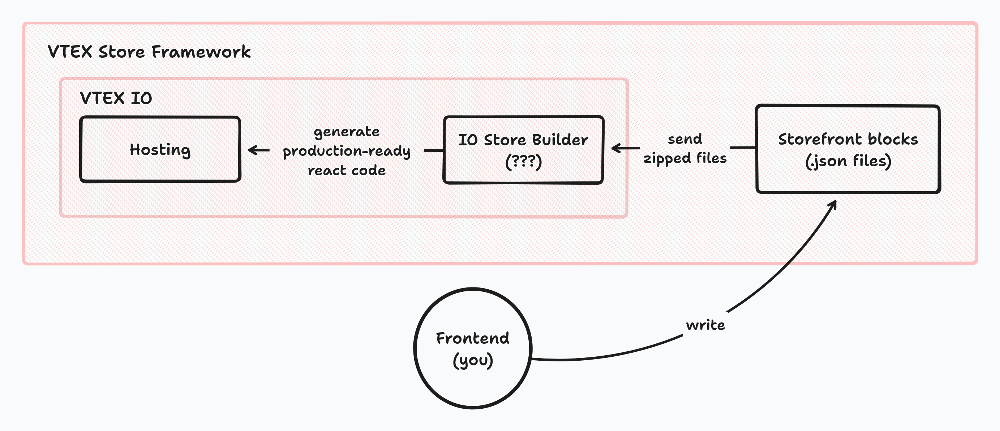
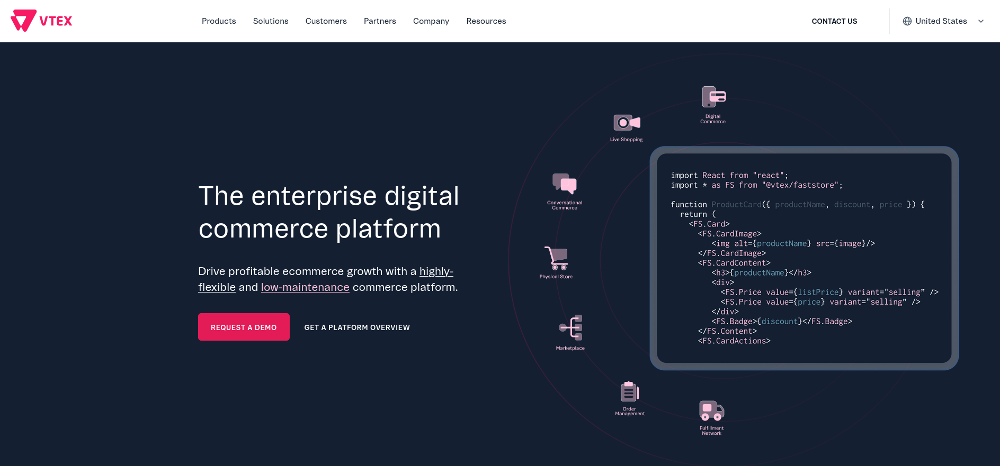
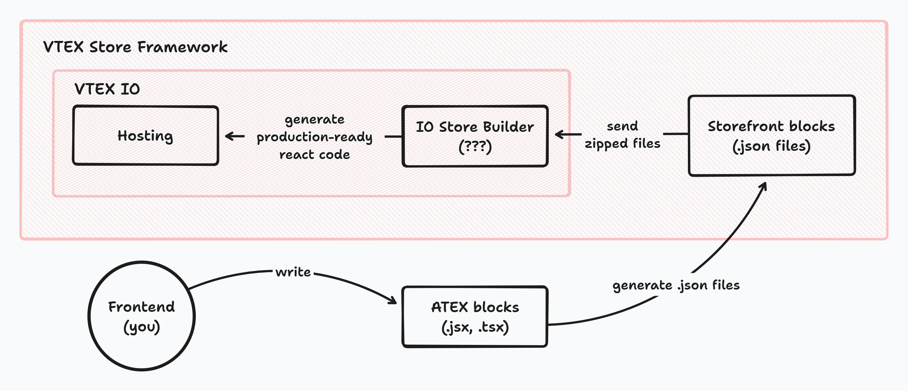
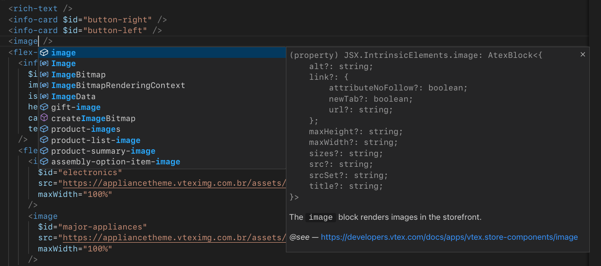

<p align="center"></p>

# ATEX 💣

A [Vite](https://vitejs.dev/) powered tool made for Frontend Developers working in companies that use VTEX to develop eCommerce websites.

## Why ATEX

[VTEX](https://vtex.com) is a SaaS platform with a variety of products and services dedicated to eCommerce, such as an OMS, a CMS, etc.

As a frontend developer, your job is to develop and maintain websites with one of these products, the [VTEX Store Framework](https://developers.vtex.com/docs/guides/vtex-io-documentation-what-is-vtex-store-framework).

### The Problems

From this moment, a long rant begins, so please be patient.

The VTEX Storefront Framework is a piece of ...software that lets you develop a store website using React under the hood. What do I mean by "under the hood"? It is like Next.js, isn't it? Well...

> The VTEX Store Framework is built on the **VTEX IO development platform** and **React** technology, and it is responsible for building the storefront by offering native ecommerce components in JSON format.
>
> — Official docs

Yes, you read that right.

> [...] building the storefront [...] in JSON format.

You, VTEX IO Champion, will template websites... with JSON. JSON used to generate React code. An abstraction of an abstraction.

Below is a simple diagram of how this loosely works.



You might think that there would be some way to look at the code generated by the builder, but all of that is handled by the VTEX servers, alongside Hydration (with almost no documentation) and HMR (which really should be called Cold Module Replacement, since updates can take several seconds). It is possible to write external JavaScript code if VTEX does not provide a given component, at the end of the day in this JSON DSL you are just calling components.

If you are doubting: no, this was not invented by Tom. [We all agree he is a genius](https://www.youtube.com/watch?v=QwUPs5N9I6I), but unless he had worked at this company at some point, this is not the case.

Following the previous quote:

> Our components allow you to:
>
> - Build your store frontend in the **fastest possible go-to-market**.
> - Have **comprehensive shopping experiences** that never get old.
> - Adapt these experiences to match your store's unique identity since they are highly **flexible** and allow for **high customization**.
> - Enjoy native **integration with VTEX APIs**.
> - Easily track your store view events through **analytic tools**, such as Google Tag Manager and Google Analytics.
> - Connect and collaborate with other developers, ask questions and share your knowledge at the VTEX Community.
> - **Standardize the way your team develops** frontend code.
>
> — Official docs

Eh... no, let's see why this is false, buzzword by buzzword:

- "fastest possible go-to-market", "flexible", "high customization": Suppose in a store website you have a header with a menu and a list of links pointing to product subcategories. Using a well known tool like Vanilla JavaScript it would be easy to develop, scale and add features if necessary. However, if you use the Menu component made by VTEX, you are not capable of maintaining or adding features without going crazy. [This file](./examples/store/real-world/generated-menu-items.json), which is a real world example, is something someone inevitably had to write [due to poor documentation, poor customizability and poor maintainability](https://github.com/vtex-apps/menu/pull/182). Where is the so wanted "low-code" at that file? And about the mentioned pull request, in the meantime, what are the alternative actions that guy could take besides forking the repository or writting another hundrend lines of JSON manually?

- "never get old": If that is the case, why does [their home page](https://vtex.com) advertise their [new toolkit, FastStore](https://vtex.com/us-en/vtex-io/)? Do they want to deprecate a 5 years old development framework? Next.js is older by comparison.



- ["Standardize"](https://xkcd.com/927): That word is only valid within the service itself. Using JSON as a markup language and, on top of that, [restricting CSS itself](https://developers.vtex.com/docs/guides/vtex-io-documentation-using-css-handles-for-store-customization) is the opposite of standard. Extremely convoluted CSS has had to be written because of this decision.

### A Solution

Enough ranting, let's see a posible solution to this. I had to put myself in Tom's shoes, so expect it to be a peculiar one.

To recap, the VTEX Store Framework is a code generator which takes JSON files as input, outputs a SSR React build and hosts it. If you are curious, you can visit [their examples website](https://learn.vtex.com/page/learning-path-lang-en).

If your company is not going to migrate existing websites or develop new ones from the ground up with FastStore in the near future, what could be a nice way to avoiding writting thousands of lines of JSON? Maybe we could use something reasonable like JSX to template websites.

Here is the part where I have to say sorry for those tired of the infinite build steps the web industry has invented over the years, but fire had to be fought with fire: ATEX is a JSX-to-JSON generator.



That's right, instead of using an enterprise JSON DSL, you can utilize a JSX DSL and behold the ultimate almost-full-circle pipeline: from JSX/TSX to JavaScript to JSON (to JSX again?) to JavaScript. Unironically, I'm convinced this will help VTEX IO Developers to focus on adding real value to eCommerce websites rather than working in excessive time consuming storefront templating.

If you know how templating works with the Store Framework, you can jump directly to [Getting started](#getting-started). If not, let's have a look at what it means to template with this JSON and how JSX can be taken advantage of.

#### Store Framework semantics

Briefly, inside a storefront repository, any `.json` located at `store/blocks` defines a set of React component instances using JSON objects. VTEX names these objects "blocks". Each block is a component instance defined by its corresponding properties and referenced by the component name and an identifier. For example:

```jsonc
{
  "rich-text#foo": {
    "props": {
      "text": "Hello"
    }
  },
  "rich-text#bar": {
    "props": {
      "text": "World!"
    }
  },
  "image#bar": {
    "props": {
      "width": 420,
      "height": 360
    }
  }
}
```

This object defines two `RichText` components and an `Image` component, each one with some properties and identifiers, `foo` and `bar` respectively. The identifiers are used to uniquely identify instance states in the [CMS](https://developers.vtex.com/docs/guides/vtex-io-documentation-site-editor), but that's not important here. Although they are defined, they are not rendered yet. To show them as content in a particular page we must use another component to route them. In VTEX this is done using an array of references:

```diff
// store/blocks/home.json
{
+ "store.home": {
+   "children": ["rich-text#foo", "image#bar", "rich-text#bar"]
+ },
  "rich-text#foo": {
    "props": {
      "text": "Hello"
    }
  },
  "rich-text#bar": {
    "props": {
      "text": "World!"
    }
  },
  "image#bar": {
    "props": {
      "width": 420,
      "height": 360
    }
  }
}
```

With ATEX, the JSON above can be generated by the code below:

```jsx
export default function Home() {
  return (
    <store $type="home">
      <rich-text
        $id="foo"
        text="Hello"
      />
      <image
        $id="bar"
        width={420}
        height={360}
      />
      <rich-text
        $id="bar"
        text="World!"
      />
    </store>
  )
}
```

This is the way ATEX expects you to develop, as it tries to replicate the experience of creating components using JSX, something any Frontend Developer is familiar with.

Ending the preface, let's see some basics to get into it.

## Guide

### Getting started

1. Install `atex`:

```sh
$ npm install -g atex
# or
$ yarn global add atex
# or
$ pnpm add -g atex
```

2. At your storefront repository, install the following development dependencies:

```sh
$ npm install -D typescript @types/node
# or
$ yarn add -D typescript @types/node
# or
$ pnpm add -D typescript @types/node
```

3. Go to `./.vtexignore` and add the line `atex`.

4. Create `./atex/tsconfig.json`:

```json
{
  "compilerOptions": {
    "lib": ["ESNext"],
    "jsx": "preserve",
    "resolveJsonModule": true,
    "esModuleInterop": true,
    "checkJs": true,
    "noEmit": true,
    "types": ["node", "atex/types/all"]
  }
}
```

5. Finally, create the folder `./atex/src` which will contain all the ATEX related files.

That's all! Now, to start developing, type `$ atex -w`.

### Examples

Go to [`./examples`](./examples) to see ATEX in practice.

### Usage

#### ATEX block

An ATEX block is a JSX expression that defines and references a VTEX block. To be more precise, under the hood, it is a function call that does two things:

- Returns the block's reference.
- In case there are any JSX attributes, ATEX defines its VTEX block as a JSON Object, which will be part of the generated JSON file. If there are no attributes, nothing happens. This is a valid case if you only want the reference, which may be defined elsewhere.

<table style="width:100%">
<thead>
<tr>
<th>JSX</th>
<th>JSON</th>
</tr>
</thead>
<tbody>
<tr>
<td rowspan="2">

```jsx
<rich-text />
```

</td>
<td>
Returns:

```json
["rich-text"]
```

</td>
</tr>

<tr>
<td>
Defines: Nothing
</td>
</tr>
<tr>
<td rowspan="2">

```jsx
<rich-text text="Hello world!" />
```

</td>
<td>
Returns:

```json
["rich-text"]
```

</td>
</tr>

<tr>
<td>
Defines:

```json
"rich-text": {
  "props": {
    "text": "Hello world!"
  }
}
```

</td>
</tr>
</tbody>
</table>

##### Identifier and Variant/Type

Any VTEX block instance is referenced by a combination of:

- Its component name.
- A variant of the component (Particularly, `flex-layout` is [internally two different components](https://github.com/vtex-apps/flex-layout/blob/6e480d0cbb205afe61d211857ccdb0abffee6f14/store/interfaces.json#L5-L15): `FlexLayout` as `flex-layout.row` and `Col` as `flex-layout.col`).
- A unique hardcoded identifier.

These are formatted as `"{name}.{variant}#{identifier}"`.

In ATEX, variants and identifiers are expressed with special JSX attributes: `$type` and `$id`.

<table>
<thead>
<tr>
<th>JSX</th>
<th>JSON</th>
</tr>
</thead>
<tbody>
<tr>
<td>

```jsx
<foo />
```

</td>
<td>

```json
["foo"]
```

</td>
</tr>

<tr>
<td>

```jsx
<foo $id="bar" />
```

</td>
<td>

```json
["foo#bar"]
```

</td>
</tr>

<tr>
<td>

```jsx
<foo $type="bar" />
```

</td>
<td>

```json
["foo.bar"]
```

</td>
</tr>

<tr>
<td>

```jsx
<foo
  $type="bar"
  $id="baz"
/>
```

</td>
<td>

```json
["foo.bar#baz"]
```

</td>
</tr>
</tbody>
</table>

##### Children and nested elements

Looking at the examples above, why are references returned as string arrays? Because in VTEX it is very common to declare a block's children in this way.

<table>
<thead>
<tr>
<th>JSX</th>
<th>JSON</th>
</tr>
</thead>
<tbody>
<tr>
<td rowspan="2">

```jsx
<flex-layout $type="row">
  <rich-text text="Hello world!" />
</flex-layout>
```

</td>
<td>
Returns:

```json
["flex-layout.row"]
```

</td>
</tr>

<tr>
<td>
Defines:

```json
{
  "flex-layout.row": {
    "children": ["rich-text"]
  },
  "rich-text": {
    "props": {
      "text": "Hello world!"
    }
  }
}
```

</td>
</tr>
<tr>
<td rowspan="2">

```jsx
<flex-layout $type"row">
  <rich-text text="Hello world!" />
  <video
    autoPlay
    src="https://youtu.be/dQw4w9WgXcQ"
  />
</flex-layout>
```

</td>
<td>
Returns:

```json
["flex-layout.row"]
```

</td>
</tr>

<tr>
<td>
Defines:

```json
{
  "flex-layout.row": {
    "children": ["rich-text", "video"]
  },
  "rich-text": {
    "props": {
      "text": "Hello world!"
    }
  },
  "video": {
    "props": {
      "autoPlay": true,
      "src": "https://youtu.be/dQw4w9WgXcQ"
    }
  }
}
```

</td>
</tr>
</tbody>
</table>

**Warning:** I have said "it is very common" but [this is not always the case](https://developers.vtex.com/docs/apps/vtex.condition-layout#step-3-defining-the-desired-conditions). `"Then"` and `"Else"` props accept strings, not string arrays. As a workaround, and knowing that every JSX expression always returns a string array, you can type `(<component-name />)[0]` to get the `"component-name"` string value. Yeah, it's a little gross.

<table>
<thead>
<tr>
<th>JSX</th>
<th>JSON</th>
</tr>
</thead>
<tbody>
<tr>
<td rowspan="2">

```jsx
<store $type="product">
  <condition-layout
    $type="product"
    $id="cond1"
    conditions={[
      {
        subject: 'productId',
        arguments: {
          id: '12',
        },
      },
    ]}
    Then={
      (
        <flex-layout
          $type="row"
          $id="custom-pdp-layout-12"
        />
      )[0]
    }
    Else={
      (
        <flex-layout
          $type="row"
          $id="default"
        />
      )[0]
    }
  />
</store>
```

</td>
<td>
Returns:

```json
["store.product"]
```

</td>
</tr>

<tr>
<td>
Defines:

```json
{
  "store.product": {
    "children": ["condition-layout.product#cond1"]
  },
  "condition-layout.product#cond1": {
    "props": {
      "conditions": [
        {
          "subject": "productId",
          "arguments": {
            "id": "12"
          }
        }
      ]
      "Then": "flex-layout.row#custom-pdp-layout-12",
      "Else": "flex-layout.row#default"
    }
  }
}
```

</td>
</tr>
</tbody>
</table>

##### Upper-level attributes

By default, well named JSX attributes are included inside the `"props"` key, like [the examples above](#atex-block). But what about the `"blocks"` key which behaves similar to `"children"`, [the `"parent"` key](https://developers.vtex.com/docs/guides/vtex-io-documentation-customizing-the-header-and-footer-blocks-by-page), or anything that appears outside `"props"`? A solution to this is adding a `_` prefix to those attributes, like `_blocks`, `_parent`, etc.

<table>
<thead>
<tr>
<th>JSX</th>
<th>JSON</th>
</tr>
</thead>
<tbody>
<tr>
<td rowspan="2">

```jsx
<shelf
  $id="home"
  maxItems={50}
  _blocks={
    <product-summary $type="shelf">
      <product-list-price />
      <product-selling-price $id="summary" />
      <product-price-savings />
      <product-installments />
    </product-summary>
  }
/>
```

</td>
<td>
Returns:

```json
["shelf#home"]
```

</td>
</tr>

<tr>
<td>
Defines:

```json
{
  "shelf#home": {
    "blocks": ["product-summary.shelf"],
    "props": {
      "maxItems": 50
    }
  },
  "product-summary.shelf": {
    "children": [
      "product-list-price",
      "product-selling-price#summary",
      "product-price-savings",
      "product-installments"
    ]
  }
}
```

</td>
</tr>
</tbody>
</table>

##### Fragment

To render more than one block without a parent, you can use a Fragment, like in React.

<table>
<thead>
<tr>
<th>JSX</th>
<th>JSON</th>
</tr>
</thead>
<tbody>
<tr>
<td rowspan="2">

```jsx
<>
  <rich-text text="Hello world!" />
  <video
    autoPlay
    src="https://youtu.be/dQw4w9WgXcQ"
  />
</>
```

</td>
<td>
Returns:

```json
["rich-text", "video"]
```

</td>
</tr>

<tr>
<td>
Defines:

```json
{
  "rich-text": {
    "props": {
      "text": "Hello world!"
    }
  },
  "video": {
    "props": {
      "autoPlay": true,
      "src": "https://youtu.be/dQw4w9WgXcQ"
    }
  }
}
```

</td>
</tr>
</tbody>
</table>

As seen, it returns multiple references instead of a single item.

#### Modules

##### ATEX Module (JSX/TSX)

An ATEX Module is a `.jsx/tsx` file which is used to export a `.json` to `store` like this:

- `foo.jsx -> foo.json`
- `blocks/bar/baz.tsx -> blocks/bar/baz.json`

It **must** export a default function without parameters, returning JSX code, which will be called and will define a file scoped JSON Object.

```jsx
export default () => (
  // -> insert jsx here <-
)
```

In modern UI Frameworks like [Next.js](https://nextjs.org/docs/app/building-your-application/routing/defining-routes#creating-ui), [Gatsby](https://www.gatsbyjs.com/docs/reference/routing/creating-routes/#define-routes-in-srcpages) or [SolidStart](https://start.solidjs.com/core-concepts/routing#creating-new-pages) exporting default functions are required to define routes, which can be another point of view to compare and, eventually, get used to.

##### JS/TS

Regular JavaScript/TypeScript files can be used to declare variables, helper functions, etc. In practice, their purpose is to be imported by ATEX Modules, like in [this example](./examples/atex/src/real-world/menu-items.ts).

##### JSON

In ATEX, a file with this human-readable format has three special features.

- It can be [imported](https://vitejs.dev/guide/features.html#json).
- Its JSON is exported like an ATEX Module. However, it is done as it is, meaning that it behaves the same as if it were in `store`. So, you could write normal VTEX blocks, `routes.json`, `interfaces.json`, etc in `atex/src`.
- If you want to write and consume a JSON module without exporting it to `store`, add a `_` prefix to its basename.

**Warning:** JSON extensions like JSONC or JSON5 are not supported.

##### Propagation

Naturally, when you are running `atex` in watch mode, a file change will re-execute any module importing it.

#### ATEX Component

An ATEX Component lets you split JSX away from the default function and avoid code duplication. Think of it as a regular React component.

```tsx
import type { Component } from 'atex/types'

// Any ATEX Component is typed as
// Component<T> = (props: T, children?: string[]) => string[]

const Foo: Component<{ bar: boolean }> = (props, children) => (
  <baz bar={props.bar}>{children}</baz>
)

export default () => (
  <>
    <Foo bar />
    <another-block />
  </>
)
```

Keep in mind that each call of a component may be invalid if it produces two different definitions with the same reference; you can use a property as an identifier to solve it.

```tsx
import type { Component } from 'atex/types'

interface IFoo {
  $id: string // It can be named whatever you want
  bar: boolean
}

const Foo: Component<IFoo> = (props, children) => (
  <baz
    $id={props.$id}
    bar={props.bar}
  >
    {children}
  </baz>
)

export default () => (
  <>
    <Foo
      $id="1"
      bar
    />
    <Foo
      $id="2"
      bar={false}
    >
      <another-block />
    </Foo>
  </>
)
```

**Author's note:** It can be difficult to understand, even more considering [this behaviour](#importing-atex-components), and might be unnecesary, but the option to use it exists.

### IDE

Get rid of your custom JSON snippets and leverage your favourite IDE using the autocompletion, type checking, documentation, etc.



### Types

If you visit [`./types`](./types) you will see a list of types for each VTEX App adapted to this project. They can be configured in `tsconfig.json` `compilerOptions.types`.

#### Type checking

Even though your IDE gives you hints about your types, ATEX does not perform any type checking; it just runs transpiled JavaScript. Knowing that, lots of bugs can occur if your IDE is not efficient enough.

However, it is posible to type check all ATEX modules by executing `tsc -p atex/tsconfig.json`, which can be useful before doing a `vtex release`, for example. Even more, it can be automatically called via `manifest.json` `scripts.prereleasy`.

#### Ambiguous types

Although [`./types`](./types) is production ready, there are some details to be careful about.

First, any JSX element has at least [these properties](./types/index.d.ts#L1). That does not mean they are all correct in VTEX. For example, `"blockClass"` is not always used in all VTEX blocks.

Second, which is also related to the previous one, there are some VTEX blocks whose properties are not documented, so you have to search [its source code](https://github.com/vtex-apps) manually and see the types I have not found.

Because of a lot of sparsed VTEX documentation and scarce time, any PR including type fixes will be gladly merged.

#### Custom block types

If there is a JSX element in your code unnamed in [`./types`](./types) it is weakly typed, like Vanilla JavaScript. This will always occur with custom blocks.

If you want to type a custom block you have to keep in mind if its source code is inside the store project (`./react` folder) or if it is in an external app. In all cases, it is up to you where its declaration file (`.d.ts`) should be located and how it is installed, as it is not part of this project' scope.

Besides that, an idea could be the following if it is an external app, which is the most complicated to solve: To have a single source of truth, include the declaration file inside the app repository. It may be necessary to install `atex` there to have its basic types. Then, publish it as a normal npm package and install it in the store repository. Finally, you can add it in `tsconfig.json`.

### Import Aliases

ATEX supports [import aliases](https://www.typescriptlang.org/tsconfig#paths) defined in `tsconfig.json` `compilerOptions.paths` configuration.

```diff
{
  "compilerOptions": {
+   "paths": {
+     "@content/*": ["./src/content/*"]
+   }
  }
}
```

```jsx
// before
import { menuItems } from '../../../content/header'

// after
import { menuItems } from '@content/header'
```

**Note:** You need to restart ATEX when you update your paths mappings.

### Quirks

Due to the project implementation, limited by the framework abstractions, there are some things to keep in mind that can be confusing and unexpected.

#### `__fold__` block and naming conventions

By convention, almost all VTEX blocks are named using `kebab-case`, which is great for the JSX transpiler. Unfortunately, there are some counterexamples. One of these is [the `__fold__` block](https://developers.vtex.com/docs/guides/fold-block) which is not considered a valid element name but rather a JavaScript identifier because it starts with a non-alphabetical character. Another case is `CamelCased` blocks because the transpiler considers it a component identifier.

When these kind of scenarios happens, ATEX will throw a `ReferenceError: <identifier> is not defined` error. A workaround to remediate this is to use correctly named variables which wrap the block names.

```jsx
const Fold = '__fold__'
const AnotherBlock = 'InvalidNamedBlock'

export default () => (
  <store
    $type="home"
    _blocks={
      <>
        <carousel $id="home" />
        <Fold $type="desktop" />
        <shelf $id="home" />
        <AnotherBlock />
      </>
    }
  />
)
```

Ignoring the `__fold__` case, it is recommended to name your custom blocks using `kebab-case` to avoid code smell.

#### Importing ATEX Components

This topic is a little hard to explain, so first let's loosen up with a simple example.

If you look at [this folder](./examples/atex/src/complex/Carousel%20blocks), you will see that `home.tsx` is using the `SliderHome` component defined in `slider-layout.tsx`. Then, its JSON definition is included in [`slider-layout.json`](./examples/store/complex/Carousel%20blocks/slider-layout.json) and its reference is included in [`home.json`](./examples/store/complex/Carousel%20blocks/home.json). Reasonable, right?

But what happens if `SliderHome` accepts props? Where will be defined?

```tsx
import SliderHome from './slider-layout'

export default () => (
  <store
    $type="home"
    _blocks={
      <>
        <rich-text />
        <info-card $id="button-right" />
        <info-card $id="button-left" />
        <flex-layout $type="row" />
        <SliderHome width={460} />
      </>
    }
  />
)
```

First, `slider-layout.tsx` will throw an error because it is a default function with parameters. A default function must be called with no parameters. If we remove the `default` keyword, `SliderHome` will only be a function called in `home.tsx`. Where will its JSON definition be? In theory, at the `slider-layout.tsx` scope, but in reality nowhere. For better or worse, any imported ATEX component called with parameters cannot have its JSON definition exported, only its reference.

To conclude, it is only useful to import ATEX components without parameters.

#### `_props` attribute

This special attribute is not recommended, but it can be used if there is a need to overwrite/add an untyped or invalid property. It is also an alternative to the `// @ts-ignore` line.

<table style="width:100%">
<thead>
<tr>
<th>`@ts-ignore`</th>
<th>`_props`</th>
</tr>
</thead>
<tbody>
<tr>
<td>

```tsx
<condition-layout
  $type="product"
  // @ts-ignore
  foo="untyped property"
  // @ts-ignore
  bar="untyped property"
  // @ts-ignore
  baz="untyped property"
/>
```

</td>
<td>

```tsx
<condition-layout
  $type="product"
  _props={{
    foo: 'untyped property',
    bar: 'untyped property',
    baz: 'untyped property',
  }}
/>
```

</td>
</tr>
</tbody>
</table>

### CLI

```
Usage:
  $ atex [options]

Options:
  -w, --watch             [boolean] Watch changes from "atex/src" directory (default: false)
  --clearScreen           [boolean] Allow/disable clear screen when logging (default: false)
  -l, --logLevel <level>  [string] info | warn | error | silent (default: info)
  -v, --version           Display version number
  -h, --help              Display this message
```

### Incremental migration

As explained in [Usage/JSON](#json), ATEX supports `.json` files which behave the same as if they were at `store`. So, if you are considering a migration, you can copy all files from `store` to `atex/src` and slowly replace them with ATEX modules.

**Warning:** JSON extensions like JSONC or JSON5 are not supported.

## Legal

The ATEX project is under the LGPLv3 license with no partnership with VTEX (NYSE: VTEX).
