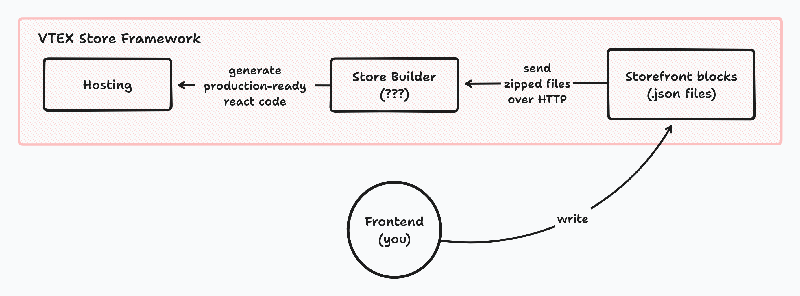
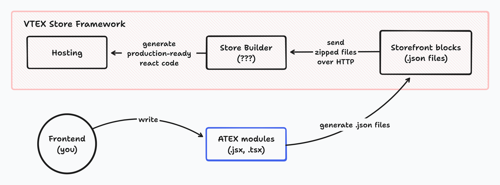

<p align="center"></p>

# ATEX 💣

A [Vite](https://vitejs.dev/) powered tool dedicated to Frontends (named as "VTEX IO Developers") who are working in companies that chooses VTEX to develop eCommerce websites.

## Why ATEX

[VTEX](https://vtex.com) is a SaaS platform with a variety of products and services dedicated to eCommerce, like an OMS, a CMS, etc.

As a Frontend Developer, your job is to develop and maintain websites with one of those products, the [VTEX Store Framework](https://developers.vtex.com/docs/guides/vtex-io-documentation-what-is-vtex-store-framework).

### The Problems

From this moment, a long rant begins, so please be patient.

The VTEX Store Framework. This piece of ...software lets you develop a store website using React under the hood.

Wait, what do you mean about "React under the hood"? It's like Next.js, isn't it?

...

> The VTEX Store Framework is built on the **VTEX IO development platform** and **React** technology, and it is responsible for building the storefront by offering native ecommerce components in JSON format.
>
> — Official docs

Yep, that's what you've read.

> [...] building the storefront [...] in JSON format.

You, VTEX IO Champion, will template websites... with JSON.

~html?~ JSON.

JSON used to generate React code. An abstraction over an already high level abstraction.

Below I show you a little diagram of how loosely works.



You might ask, given that generator, builder, compiler or whatever it is called, is there some local environment to look at the JavaScript code output? No, all of that is built by VTEX servers, handling things like Hydration (If you notice it via bugs, there is merely one blog post talking about it) and HMR (I would say Cold Module Replacement because it that lasts seconds to update).

It is possible to write real external JavaScript code if VTEX doesn't provide X component, at the end of the day in this JSON DSL you're just calling components.

If you are doubting: no, it was not invented by Tom. [We all agree he is a genius](https://www.youtube.com/watch?v=QwUPs5N9I6I), but unless he had worked at this company at some point, this is not the case.

Following the previous quote:

> Our components allow you to:
>
> - Build your store frontend in the **fastest possible go-to-market**.
> - Have **comprehensive shopping experiences** that never get old.
> - Adapt these experiences to match your store's unique identity since they are highly **flexible** and allow for **high customization**.
> - Enjoy native **integration with VTEX APIs**.
> - Easily track your store view events through **analytic tools**, such as Google Tag Manager and Google Analytics.
> - Connect and collaborate with other developers, ask questions and share your knowledge at the VTEX Community.
> - **Standardize the way your team develops** frontend code.
>
> — Official docs

Eh... no, let's see why it is false, buzzword by buzzword:

- "fastest possible go-to-market", "flexible", "high customization": Suppose in a store website you have a header with a menu and a list of links pointing to product sub/categories. Using a well known tool like Vanilla JavaScript it would be easy to develop, scale and add features if necessary. However, if you only use the Menu component made by VTEX and not creating another one, you are not capable of mantain or add features without going crazy. [This file](./examples/store/real-world/generated-menu-items.json), which is a real world example, is something inevitably someone had to write [due to poor documentation, customizability and maintainability](https://github.com/vtex-apps/menu/pull/182). Where is the "low-code" code there? And about the mentioned pull request, in the meantime, what are the alternative actions that guy could do besides forking the repository or writting another hundrend of JSON manually?

- "never get old": If that is the case, why at [the home page](https://vtex.com) the Store Framework is not advertised but their [new toolkit, FastStore](https://vtex.com/us-en/vtex-io/)? Do they want to deprecate an only 5 years of development framework? Next.js is older in comparison.


- "Standardize": First, that word is exclusively valid inside this service. Who can think using JSON as a markup language and, on top of that, [restricting CSS itself](https://developers.vtex.com/docs/guides/vtex-io-documentation-using-css-handles-for-store-customization) is a good idea? You've not seen the convoluted CSS it has had to be written because of this decision. Second, https://xkcd.com/927.

### A Solution

Enough ranting, let's see a posible solution to this. I had to put myself in Tom's shoes so expect to be a perfect one (?).

To recap, the VTEX Store Framework is a code generator which takes JSON files as input, outputs a SSR React build and hosts it. If you are curious, you can visit a website they made to [look at examples](https://learn.vtex.com/page/learning-path-lang-en).

If your company is not going to migrate existing websites or develop new ones from the ground up with FastStore in the near future, what could be a nice thing to stop this pedantry? Avoiding writting thousands of JSON and use something reasonable like JSX to template websites.

Here is the part where I've to say sorry for those aware of the infinite build steps the Web Industry has invented over the years, the fire had to be fought with fire: ATEX is a JSX-to-JSON generator.



That's right, instead of using an enterprise JSON DSL, utilize a JSX DSL and behold the ultimate almost-full-circle pipeline: from JSX/TSX to JavaScript to JSON (to JSX again?) to JavaScript.

Unironically, I'm convinced this will help VTEX IO Developers to focus on adding real value to eCommerce websites rather than consuming excessive time and resources in the Storefront templating.

If you know about templating with Store Framework, you can jump directly into [Getting started](#getting-started). In any case, let's have a look at what it means to template with this JSON and how JSX can be taken advantage of.

#### Store Framework semantics

Briefly, inside a storefront repository, any `.json` located at `store/blocks` defines a set of React component instances using JSON Objects. VTEX names those Objects as "blocks".

Each block is a component instance defined by its corresponding properties and referenced by the component name and an identifier.

For example:

```jsonc
{
  "rich-text#foo": {
    "props": {
      "text": "Hello"
    }
  },
  "rich-text#bar": {
    "props": {
      "text": "World!"
    }
  },
  "image#bar": {
    "props": {
      "width": 420,
      "height": 360
    }
  }
}
```

It's theoretically defining two `RichText` and one `Image` components, each one with some properties and identifiers, `foo` and `bar` respectively. The latter are used to uniquely identify instance states in the [CMS](https://developers.vtex.com/docs/guides/vtex-io-documentation-site-editor), but that's not important here.

Although they are defined, they're not rendered yet. To show them as content in a particular page we could use another component that organizes and renders them at some page.

Following the example:

```diff
// store/blocks/home.json
{
+ "store.home": {
+   "children": ["rich-text#foo", "image#bar", "rich-text#bar"]
+ },
  "rich-text#foo": {
    "props": {
      "text": "Hello"
    }
  },
  "rich-text#bar": {
    "props": {
      "text": "World!"
    }
  },
  "image#bar": {
    "props": {
      "width": 420,
      "height": 360
    }
  }
}
```

And asuming that `"store.home"` is another component that renders its children at the home page, with ATEX the code below will exactly generate that JSON:

```jsx
export default function Home() {
  return (
    <store $type="home">
      <rich-text
        $id="foo"
        text="Hello"
      />
      <image
        $id="bar"
        width={420}
        height={360}
      />
      <rich-text
        $id="bar"
        text="World!"
      />
    </store>
  )
}
```

This is the way ATEX expects you to develop, as it tries to replicate the experience of creating components using JSX, something any Frontend Dev is familiar with.

Ending the preface, let's see some basics to get into it.

## Guide

### Getting started

1. Install `atex`:

```sh
$ npm install -g atex
# or
$ yarn global add atex
# or
$ pnpm add -g atex
```

2. At your storefront repository, install `@types/node` as a dev dependency.

3. Go to `./.vtexignore` and add the line `atex`.

4. Write at `./atex/tsconfig.json`:

```json
{
  "compilerOptions": {
    "lib": ["ESNext"],
    "jsx": "preserve",
    "resolveJsonModule": true,
    "esModuleInterop": true,
    "checkJs": true,
    "noEmit": true,
    "types": ["node", "atex/types/all"]
  }
}
```

5. Finally, create the folder `./atex/src` which will contain all the ATEX related files.

That's all! Now, to start to developing with it, type `$ atex -w`.

### Examples

Go to [`./examples`](./examples) to see ATEX in practice.

### Usage

#### ATEX block

An ATEX block is any JSX expression that defines and references a VTEX block. To be more precise, under the hood, it is a function call that does two things:

- Returns the block's reference.
- In case there are any JSX attribute, ATEX defines its VTEX block as a JSON Object, which will be part of the generated file scoped JSON. On the contrary, it does nothing; it's a valid case if you simply want the reference, maybe it's defined in another place.

<table style="width:100%">
<thead>
<tr>
<th>JSX</th>
<th>JSON</th>
</tr>
</thead>
<tbody>
<tr>
<td rowspan="2">

```jsx
<rich-text />
```

</td>
<td>
Returns:

```json
["rich-text"]
```

</td>
</tr>

<tr>
<td>
Defines: Nothing
</td>
</tr>
<tr>
<td rowspan="2">

```jsx
<rich-text text="Hello world!" />
```

</td>
<td>
Returns:

```json
["rich-text"]
```

</td>
</tr>

<tr>
<td>
Defines:

```json
"rich-text": {
  "props": {
    "text": "Hello world!"
  }
}
```

</td>
</tr>
</tbody>
</table>

##### Identifier and Variant/Type

Any VTEX block instance is referenced by a combination of:

- Its component name.
- A variant of the component (Particularly, the `flex-layout` is [internally two different components](https://github.com/vtex-apps/flex-layout/blob/6e480d0cbb205afe61d211857ccdb0abffee6f14/store/interfaces.json#L5-L15): `FlexLayout` as `flex-layout.row` and `Col` as `flex-layout.col`).
- A unique hardcoded identifier.

formated as `"{name}.{variant}#{identifier}"`.

In ATEX, the last two bullets are expressed with special JSX attributes: `$id` and `$type`.

<table>
<thead>
<tr>
<th>JSX</th>
<th>JSON</th>
</tr>
</thead>
<tbody>
<tr>
<td>

```jsx
<foo />
```

</td>
<td>

```json
["foo"]
```

</td>
</tr>

<tr>
<td>

```jsx
<foo $id="bar" />
```

</td>
<td>

```json
["foo#bar"]
```

</td>
</tr>

<tr>
<td>

```jsx
<foo $type="bar" />
```

</td>
<td>

```json
["foo.bar"]
```

</td>
</tr>

<tr>
<td>

```jsx
<foo
  $type="bar"
  $id="baz"
/>
```

</td>
<td>

```json
["foo.bar#baz"]
```

</td>
</tr>
</tbody>
</table>

##### Children and nested elements

Looking at the examples above, why are references returned as string arrays? Because in VTEX it's very common to declare a block's children in this way.

<table>
<thead>
<tr>
<th>JSX</th>
<th>JSON</th>
</tr>
</thead>
<tbody>
<tr>
<td rowspan="2">

```jsx
<flex-layout $type="row">
  <rich-text text="Hello world!" />
</flex-layout>
```

</td>
<td>
Returns:

```json
["flex-layout.row"]
```

</td>
</tr>

<tr>
<td>
Defines:

```json
{
  "flex-layout.row": {
    "children": ["rich-text"]
  },
  "rich-text": {
    "props": {
      "text": "Hello world!"
    }
  }
}
```

</td>
</tr>
<tr>
<td rowspan="2">

```jsx
<flex-layout $type"row">
  <rich-text text="Hello world!" />
  <video
    autoPlay
    src="https://youtu.be/dQw4w9WgXcQ"
  />
</flex-layout>
```

</td>
<td>
Returns:

```json
["flex-layout.row"]
```

</td>
</tr>

<tr>
<td>
Defines:

```json
{
  "flex-layout.row": {
    "children": ["rich-text", "video"]
  },
  "rich-text": {
    "props": {
      "text": "Hello world!"
    }
  },
  "video": {
    "props": {
      "autoPlay": true,
      "src": "https://youtu.be/dQw4w9WgXcQ"
    }
  }
}
```

</td>
</tr>
</tbody>
</table>

**Warning:** I've said "it's very common" but [it's not always true](https://developers.vtex.com/docs/apps/vtex.condition-layout#step-3-defining-the-desired-conditions). `"Then"` and `"Else"` props accepts strings, not string arrays. As a working around, and knowing that any JSX expression always returns a string array, you can type `(<component-name />)[0]` to get the `"component-name"` string value. Yeah, it's a little gross.

<table>
<thead>
<tr>
<th>JSX</th>
<th>JSON</th>
</tr>
</thead>
<tbody>
<tr>
<td rowspan="2">

```jsx
<store $type="product">
  <condition-layout
    $type="product"
    $id="cond1"
    conditions={[
      {
        subject: 'productId',
        arguments: {
          id: '12',
        },
      },
    ]}
    Then={
      (
        <flex-layout
          $type="row"
          $id="custom-pdp-layout-12"
        />
      )[0]
    }
    Else={
      (
        <flex-layout
          $type="row"
          $id="default"
        />
      )[0]
    }
  />
</store>
```

</td>
<td>
Returns:

```json
["store.product"]
```

</td>
</tr>

<tr>
<td>
Defines:

```json
{
  "store.product": {
    "children": ["condition-layout.product#cond1"]
  },
  "condition-layout.product#cond1": {
    "props": {
      "conditions": [
        {
          "subject": "productId",
          "arguments": {
            "id": "12"
          }
        }
      ]
      "Then": "flex-layout.row#custom-pdp-layout-12",
      "Else": "flex-layout.row#default"
    }
  }
}
```

</td>
</tr>
</tbody>
</table>

##### Upper-level attributes

By default, well named JSX attributes are included inside the `"props"` key, like [the examples above](#atex-block). What about the `"blocks"` key which behaves similar to `"children"`, [the `"parent"` key](https://developers.vtex.com/docs/guides/vtex-io-documentation-customizing-the-header-and-footer-blocks-by-page), or anything that appears outside `"props"`? A solution to this is adding a `_` prefix to those attributes, like `_blocks`, `_parent`, etc.

<table>
<thead>
<tr>
<th>JSX</th>
<th>JSON</th>
</tr>
</thead>
<tbody>
<tr>
<td rowspan="2">

```jsx
<shelf
  $id="home"
  maxItems={50}
  _blocks={
    <product-summary $type="shelf">
      <product-list-price />
      <product-selling-price $id="summary" />
      <product-price-savings />
      <product-installments />
    </product-summary>
  }
/>
```

</td>
<td>
Returns:

```json
["shelf#home"]
```

</td>
</tr>

<tr>
<td>
Defines:

```json
{
  "shelf#home": {
    "blocks": ["product-summary.shelf"],
    "props": {
      "maxItems": 50
    }
  },
  "product-summary.shelf": {
    "children": [
      "product-list-price",
      "product-selling-price#summary",
      "product-price-savings",
      "product-installments"
    ]
  }
}
```

</td>
</tr>
</tbody>
</table>

##### Fragment

To render more than one block without a parent, use the classic Fragment syntax.

<table>
<thead>
<tr>
<th>JSX</th>
<th>JSON</th>
</tr>
</thead>
<tbody>
<tr>
<td rowspan="2">

```jsx
<>
  <rich-text text="Hello world!" />
  <video
    autoPlay
    src="https://youtu.be/dQw4w9WgXcQ"
  />
</>
```

</td>
<td>
Returns:

```json
["rich-text", "video"]
```

</td>
</tr>

<tr>
<td>
Defines:

```json
{
  "rich-text": {
    "props": {
      "text": "Hello world!"
    }
  },
  "video": {
    "props": {
      "autoPlay": true,
      "src": "https://youtu.be/dQw4w9WgXcQ"
    }
  }
}
```

</td>
</tr>
</tbody>
</table>

As seen, it returns multiple references instead of a single item array.

#### Modules

##### ATEX Module (JSX/TSX)

An ATEX Module is a `.jsx/tsx` file used to always export a `.json` to `store` named like this:

- `foo.jsx -> foo.json`
- `blocks/bar/baz.tsx -> blocks/bar/baz.json`

It **must** export a default function without parameters, returning JSX code, which will be called and will define a file scoped JSON Object.

```jsx
export default () => (
  // -> insert jsx here <-
)
```

In modern UI Frameworks like [Next.js](https://nextjs.org/docs/app/building-your-application/routing/defining-routes#creating-ui), [Gatsby](https://www.gatsbyjs.com/docs/reference/routing/creating-routes/#define-routes-in-srcpages) or [SolidStart](https://start.solidjs.com/core-concepts/routing#creating-new-pages) exporting default functions are required to define routes, which can be another point of view to compare and, eventually, get used to.

##### JS/TS

Regular JavaScript/TypeScript files can be used to declare variables, helper functions, etc. In practice, their entirely purpose is to be imported by ATEX Modules, like in [this example](./examples/atex/src/real-world/menu-items.ts).

##### JSON

In ATEX, a file with this human-readable format has three special features.

- Can be [imported](https://vitejs.dev/guide/features.html#json).
- Its JSON is exported like an ATEX Module. However, it is done as it is, meaning that it behaves the same as if it were in `store`. So, you could write normal VTEX blocks, `routes.json`, `interfaces.json`, etc in `atex/src`.
- If you want to write and consume a JSON module without exporting it to `store`, add a `_` prefix to its basename.

**Warning:** JSON extensions like JSONC or JSON5 are not supported.

##### Propagation

Naturally, when you're running `atex` in watch mode, a file change will re-execute any module importing it.

#### ATEX Component

An ATEX Component is used to split JSX away from the default function and to avoid repeated code. You can think of it as a regular component.

```tsx
import type { AtexComponent } from 'atex/types'

// Any ATEX Component is typed as
// AtexComponent<T> = (props: T, children?: string[]) => string[]

const Foo: AtexComponent<{ bar: boolean }> = (props, children) => (
  <baz bar={props.bar}>{children}</baz>
)

export default () => (
  <>
    <Foo bar />
    <another-block />
  </>
)
```

Keep in mind that each component call may be invalid if it produces two different definitions with the same reference; you could use a property as an identifier to solve it.

```tsx
import type { AtexComponent } from 'atex/types'

interface IFoo {
  $id: string // It can be named whatever you want
  bar: boolean
}

const Foo: AtexComponent<IFoo> = (props, children) => (
  <baz
    $id={props.$id}
    bar={props.bar}
  >
    {children}
  </baz>
)

export default () => (
  <>
    <Foo
      $id="1"
      bar
    />
    <Foo
      $id="2"
      bar={false}
    >
      <another-block />
    </Foo>
  </>
)
```

**Author's note:** It can be difficult to understand, even more considering [this behaviour](#importing-atex-components), and might be unnecesary, but the option to use it exists.

### IDE

Get rid of your custom JSON snippets and leverage your favourite IDE using the autocompletion, type checking, documentation, etc.


### Types

If you visit [`./types`](./types) you will see a list of types for each VTEX App adapted to this project. They can be configured in `tsconfig.json` `compilerOptions.types`.

#### Type checking

Even though your IDE gives you hints about your types, ATEX does not perform any type checking; it just runs transpiled JavaScript. Knowing that, lots of bugs can occur if your IDE is not efficient enough.

However, it is posible to type check all ATEX modules by executing `tsc -p atex/tsconfig.json`, which can be useful before doing a `vtex release`, for example. Even more, it can be automatically called via `manifest.json` `scripts.prereleasy`.

#### Ambiguous types

Although [`./types`](./types) is production ready, there are some details to be careful about.

First, any JSX element has at least [these properties](./types/index.d.ts#L1). That does not mean they are all correct in VTEX. For example, `"blockClass"` is not always used in all VTEX blocks.

Second, which is also related to the previous one, there are some VTEX blocks whose properties are not documented, so you have to search its source code manually and see the types I've not found.

Because of a lot of sparsed VTEX documentation and scarce time, any PR including type fixes will be gladly merged.

#### Custom block types

If there is a JSX element in your code unnamed in [`./types`](./types) it is weakly typed, like Vanilla JavaScript. This will always occur with custom blocks.

If you want to type a custom block you have to keep in mind if its source code is inside the store project (`./react` folder) or if it's in an external app. In all cases, it is up to you where its declaration file (`.d.ts`) should be located and how it's installed, as it is not part of this project' scope.

Besides that, an idea could be the following if it is an external app, which is the most complicated to solve: To have a single source of truth, include the declaration file inside the app repository. It may be necessary to install `atex` there to have its basic types. Then, publish it as a normal npm package and install it in the store repository. Finally, you can add it in `tsconfig.json`.

### Import Aliases

ATEX supports [import aliases](https://www.typescriptlang.org/tsconfig#paths) defined in `tsconfig.json` `compilerOptions.paths` configuration.

```diff
{
  "compilerOptions": {
+   "paths": {
+     "@content/*": ["./src/content/*"]
+   }
  }
}
```

```jsx
// before
import { menuItems } from '../../../content/header'

// after
import { menuItems } from '@content/header'
```

**Note:** You need to restart ATEX when you update your paths mappings.

### Quirks

Due to the project implementation, limited by the framework abstractions, there are some things to keep in mind that can be confusing and unexpected.

#### `__fold__` block and naming conventions

By convention, almost all VTEX blocks are named using `kebab-case`, which it's great for the JSX transpiler. Unfortunately, there are examples in which it doesn't happen. One of those is [this block](https://developers.vtex.com/docs/guides/fold-block) which is not considered a valid element name, but a JavaScript identifier because it starts with a non-alphabetical char. Another case is when it's `CamelCased` because the transpiler considers it a component identifier.

When these kind of scenarios happens, it throws a `ReferenceError: <identifier> is not defined`. A workaround to remediate this is to define strings with those block names somewhere.

```jsx
const Fold = '__fold__'
const AnotherBlock = 'InvalidNamedBlock'

export default () => (
  <store
    $type="home"
    _blocks={
      <>
        <carousel $id="home" />
        <Fold $type="desktop" />
        <shelf $id="home" />
        <AnotherBlock />
      </>
    }
  />
)
```

Ignoring the `__fold__` case, it is recommended to name your custom blocks using `kebab-case` to avoid code smell.

#### Importing ATEX Components

This topic is a little hard to explain, so first let's loosen up with a simple example.

If you look at [this folder](./examples/atex/src/complex/Carousel%20blocks), you will see that `home.tsx` is using the `SliderHome` component defined in `slider-layout.tsx`. Then, its JSON definition is included in [`slider-layout.json`](./examples/store/complex/Carousel%20blocks/slider-layout.json) and in [`home.json`](./examples/store/complex/Carousel%20blocks/home.json) its reference. Reasonable, right?

But what happens if `SliderHome` accepts props? Where will be defined?

```tsx
import SliderHome from './slider-layout'

export default () => (
  <store
    $type="home"
    _blocks={
      <>
        <rich-text />
        <info-card $id="button-right" />
        <info-card $id="button-left" />
        <flex-layout $type="row" />
        <SliderHome width={460} />
      </>
    }
  />
)
```

First, `slider-layout.tsx` will have an error because it is a default function with parameters, which is called without arguments. If we remove the `default` keyword and assume there is another defaulted, `SliderHome` will just be a function called in `home.tsx`. Where will be its JSON definition? In theory at `slider-layout.tsx` scope, but it is not. For better or worse, any imported ATEX component with parameters called won't have its JSON definition exported, but its reference which is useless.

To conclude, it is only useful to import ATEX components without parameters.

#### `_props` attribute

This special attribute is not recommended to use, but accepted if there is a need to overwrite/add an untyped or invalid property. It is also an alternative to using the `// @ts-ignore` line.

<table style="width:100%">
<thead>
<tr>
<th>`@ts-ignore`</th>
<th>`_props`</th>
</tr>
</thead>
<tbody>
<tr>
<td>

```tsx
<condition-layout
  $type="product"
  // @ts-ignore
  foo="untyped property"
  // @ts-ignore
  bar="untyped property"
  // @ts-ignore
  baz="untyped property"
/>
```

</td>
<td>

```tsx
<condition-layout
  $type="product"
  _props={{
    foo: 'untyped property',
    bar: 'untyped property',
    baz: 'untyped property',
  }}
/>
```

</td>
</tr>
</tbody>
</table>

### CLI

```
Usage:
  $ atex [options]

Options:
  -w, --watch             [boolean] Watch changes from "atex/src" directory (default: false)
  --clearScreen           [boolean] Allow/disable clear screen when logging (default: false)
  -l, --logLevel <level>  [string] info | warn | error | silent (default: info)
  -v, --version           Display version number
  -h, --help              Display this message
```

### Incremental migration

As explained in [Usage/JSON](#json), ATEX supports `.json` files which behave the same as if they were at `store`. So, if you're considering a migration, you could copy all files from `store` to `atex/src` and slowly replacing those with ATEX modules.

**Warning:** JSON extensions like JSONC or JSON5 are not supported.

## Legal

The ATEX project is under the LGPLv3 license with no partnership with VTEX (NYSE: VTEX).
